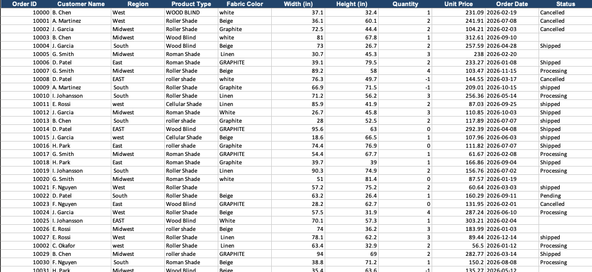
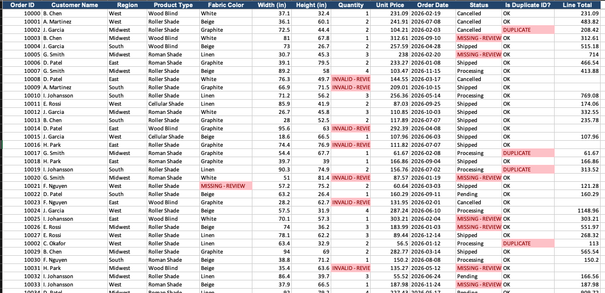
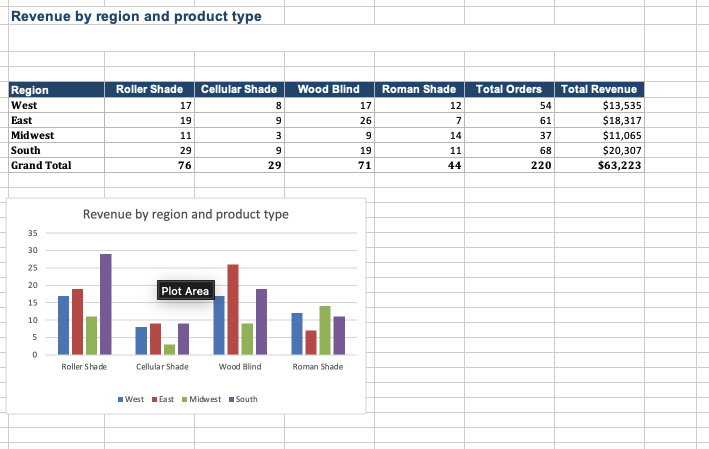

# Order Data Validation & Cleaning Demo

An Excel-based data cleaning and reporting workbook for a simulated order dataset, built entirely with formulas so every fix is traceable back to its source.

## Overview

Simulated a realistic order dataset with common data quality issues including duplicate order IDs, inconsistent text casing, missing values, invalid quantities, and mismatched customer references.

Cleaned the data using formulas only — `TRIM`, `PROPER`, `IFERROR` — so every fix stays traceable with nothing hardcoded.

Built a summary table with `SUMIFS` and `COUNTIFS` showing order volume and revenue by region and product type, fully recalculating automatically when the source data changes.

## Raw Data

The raw order data includes inconsistent casing ("EAST" vs "east" vs "East"), inconsistent product naming ("WOOD BLIND" vs "Wood Blind" vs "roller shade"), invalid negative quantities, and missing status fields.

## Cleaned & Validated Data

Each row is cleaned with `TRIM` and `PROPER` to standardize text fields, with `IFERROR` wrapping lookups so broken references fail gracefully instead of breaking the sheet. A flagging system highlights rows that are missing data, contain invalid quantities, or reference duplicate Order IDs — all driven by formulas, with nothing hardcoded.

## Summary Table

A `SUMIFS`/`COUNTIFS`-driven summary breaks down total orders and total revenue by region and product type. Because it pulls directly from the cleaned data with formulas, the table recalculates automatically whenever the source data changes — no manual refresh or hardcoded totals.

## Skills demonstrated

- Excel formulas: `TRIM`, `PROPER`, `IFERROR`, `SUMIFS`, `COUNTIFS`
- Data validation and quality flagging (missing values, duplicates, invalid entries)
- Fully traceable, formula-driven cleaning with no hardcoded fixes
- Dynamic summary reporting that recalculates with the source data
- Chart visualization of regional and product-level performance

## Sheets

| Sheet | Purpose |
|---|---|
| `Dashboard` | Overview and project description |
| `Raw_Orders` | Original, uncleaned order data with quality issues |
| `Cleaned_Orders` | Formula-cleaned data with validation flags |
| `Pivot_Summary` | SUMIFS/COUNTIFS summary by region and product type |

## File

[`Order_data_validation_demo.xlsx`](./Order_data_validation_demo.xlsx)
